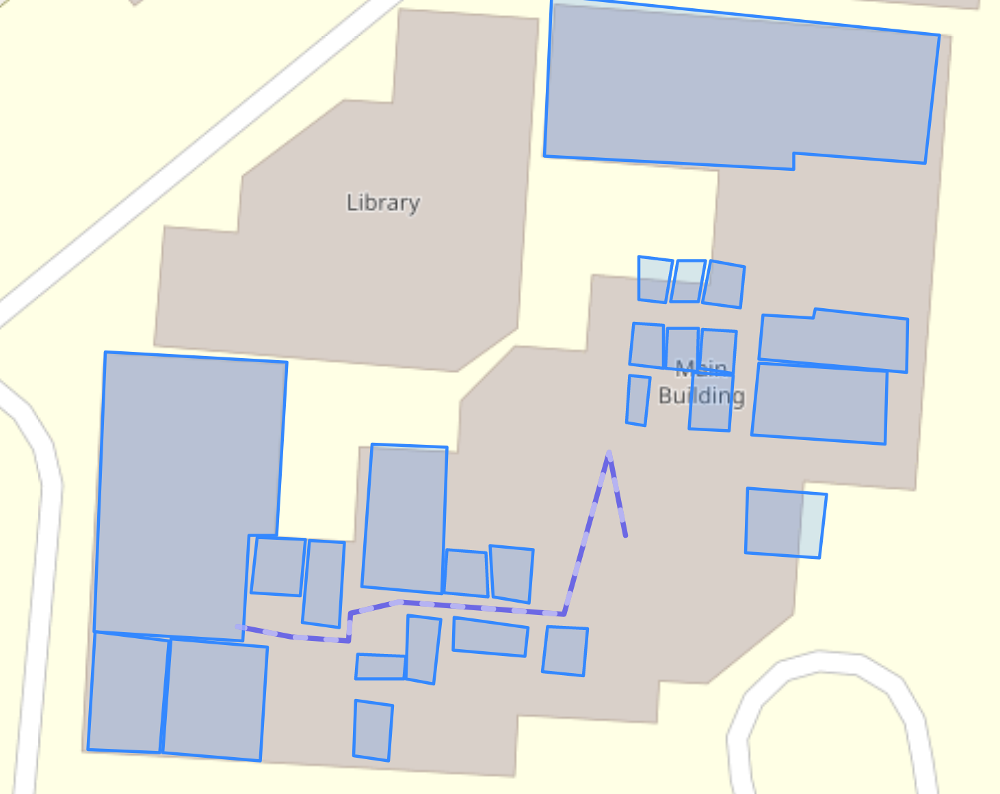

# Project for Institute Navigation

Uses geojson and folium. AI uses A-Star algorithm. Map created using [GeoJSON](https://geojson.io/#map=19.34/25.1316096/55.4196872)

## Team

Ayushi Bhandari
Divyansh Binani
Mohamed Firas Adil

## Preview



## How to run

In a virtual environment, tested on Python 3.10 (should work on most versions >= 3.6)

```bash
pip install -r requirements.txt
python main.py
```